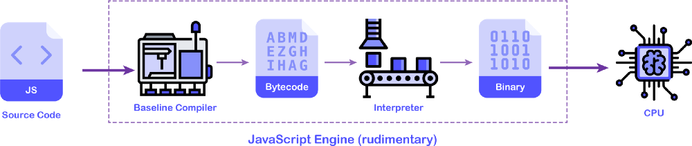
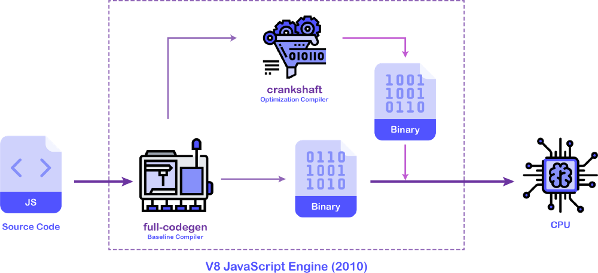
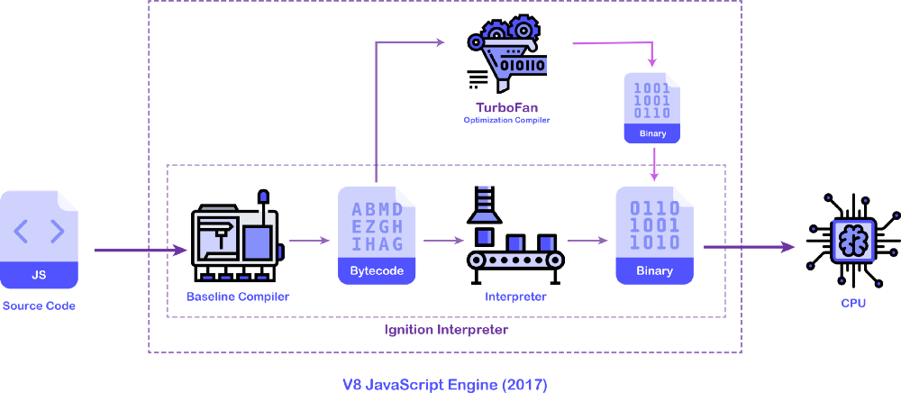

# Introduction To JavaScript

 

 

## What is JavaScript ?
JavaScript is a **dynamic** computer programming and scripting language. It is lightweight and most commonly used as a part of web pages, whose implementations allow client-side script to interact with the user and make dynamic pages.

It is **multi-paradigm** and has curly-bracket syntax, dynamic typing, prototype-based object-orientation, and first-class functions.

As a multi-paradigm language, JavaScript supports **event-driven**, functional, and imperative programming styles. It has application programming interfaces (*APIs*) for working with text, dates, regular expressions, standard data structures, and the Document Object Model (*DOM*). However, the language itself does **not include** any input/output (*I/O*), such as networking, storage, or graphics facilities, as the host environment (*usually a web browser*) provides those APIs.

JavaScript engines were originally used only in web browsers, but they are now embedded in some servers, usually via Node.js. 

**Ref** : *[Wikipedia](https://en.wikipedia.org/wiki/JavaScript)* | *[Difference Between Scripting and Programing Language](https://www.geeksforgeeks.org/whats-the-difference-between-scripting-and-programming-languages/)*

---
 

## Understanding How JavaScript Engine Works ?
JavaScript is an **interpreted** language. This means we do not have to compile the JavaScript source code before sending it to the browser. An interpreter can take the raw JavaScript code and run it for you.

JavaScript is also a dynamically typed language, unlike **C** and **C++**. This means variables declared using `var` can store any type of data type like `int`, `string`, `boolean` and also complex data types like `object` and `array`.

The **lack of type system** is what makes JavaScript slow to run. A statically typed language can produce a much efficient machine code because of the information it has about the data like its **type** and **size**.

### The Anatomy Of The JavaScript Engine
**EcmaScript specification** tells how JavaScript should be **implemented** by the browser so that a JavaScript program runs exactly the same in all the browsers, but it does **not** tell how JavaScript should **run** inside these browsers. It is up to the browser vendor to decide.

Every browser provides a **JavaScript engine** that runs the JavaScript code. The **Netscape** browser used the **SpiderMonkey** JavaScript engine. This engine was a **rudimentary** interpreter with no optimizations. Running the JavaScript code with this engine was **slow** but it worked.

 

 

A rudimentary JavaScript engine contains a **baseline compiler** whose job is to compile JavaScript source code into an intermediate representation (**IR**) which is also called the **bytecode** and feeds this bytecode to the interpreter.

The **interpreter** takes this bytecode and converts to the machine code which is eventually run on the machine’s hardware (*CPU*).

A baseline compiler’s job is to compile code as fast as possible and generate less-optimized bytecode (*or **machine code** in other cases*). Since the interpreter has an **unoptimized** bytecode to work with, the application speed will be **slow**, however, the application bootstrap time will be very less.

 

> 💡 **SpiderMoney** JS Engine has evolved into a piece of complex machinery to produce highly optimized machine code and currently used in the **Firefox** browser. 

 

When it comes to a highly dynamic and interactive web application, the user experience is very poor with this model of JavaScript execution. This problem was faced by Google’s Chrome browser while displaying **Google Maps** on the web. To increase the JavaScript performance on the web, they had to come up with a better approach.

Google Chrome from the early days uses the **V8** JavaScript engine. In the beginning, to improve the JavaScript performance, they added two pieces in their JavaScript engine pipeline as shown below.

 

 

In the **2010 version** of the **V8** JavaScript engine, there were two main pieces of machinery that did the heavy lifting for the engine. The **full-codegen** was the **baseline compiler** whose job was to spit out unoptimized machine code as fast as possible for faster application bootstrap.

As the application was running, the **crankshaft** compiler would kick in and optimize the source code and replace the parts of the machine code generated by the baseline compiler. This optimization would result in better application performance as better and better machine code is generated.

The above version of the JavaScript engine does not contain an interpreter. This is a **JIT** *(Just-In-Time)* compilation model as code is compiled to the machine level on the fly and later optimized, also to the machine code.

 

Later in 2017 **V8** team created a new version of the V8 engine from the ground up.

 

 

As you can see from the above figure, the **V8** team introduced a new interpreter pipeline **Ignition** whose job was to generate the bytecode from the JavaScript source code using a baseline compiler and later interpret that bytecode using an interpreter.

The **TurboFan** optimization compiler can optimize this bytecode in the background (*in separate threads*) as the application is running and generate a very optimized machine code that will be replaced eventually.

**Turbofan** receives the profiling data from the **Ignition** interpreter and looks for the code that is **Hot**. It can make the guesses on how to optimize the code better (by guessing the data types) and optimize or de-optimize the code.

**Ref** : *[Medium JSpoint](https://medium.com/jspoint/how-javascript-works-in-browser-and-node-ab7d0d09ac2f)* 