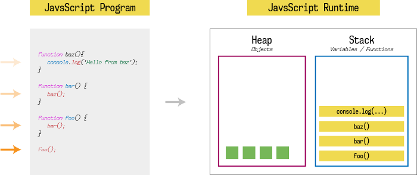
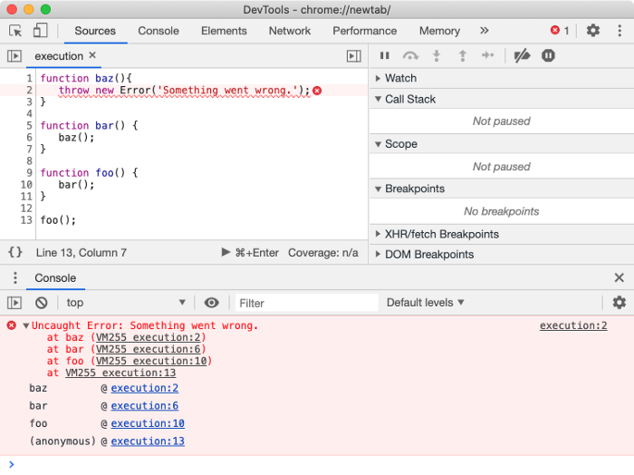
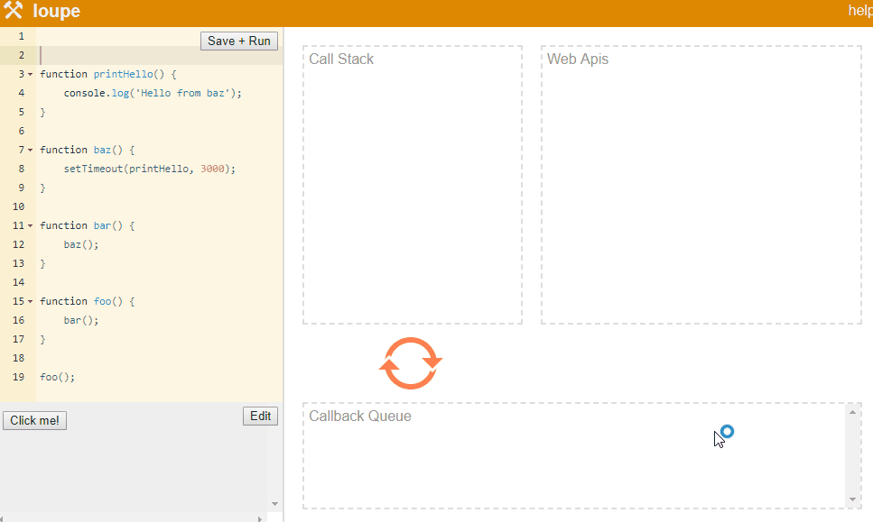

**Bookmarks** : *[JS at runtime](#jsRuntime)* | *[JS Event Loop and Web API's](#eventLoop)*

<br /><br />

# JavaScript At Runtime <a id="jsRuntime"></a>

Unlike other programming languages, JavaScript is a **single-threaded** langauge at runtime.
It means, when you open a website in the browser, it uses a single JavaScript execution thread. That thread is responsible to handle everything, like scrolling the web page, printing something on the web page, listen to DOM events (*like when the user clicks a button*), and doing other things. 

That means the code execution will be done one piece at a time. Since code execution is done sequentially, any code that takes a long time to execute will block anything that needs to be executed after that.

You can see that in action using below eternal `while` loop.

```javascript
while(true){}
```

Any code after the above statement won’t be executed as the while loop will loop infinitely until system is out of resources. This can also happen in an infinitely **recursive function call**.

Thanks to modern browsers, as not all open browser tabs rely on single JavaScript thread. Instead, they use separate JavaScript thread **per tab** or **per domain**. 

That will only freeze the current tab where that code was executed but other tabs will function normally. 

To visualize, how JavaScript executes a program, we need to understand JavaScript runtime and different components that play a part in it. So lets write a simple JavaScript program to visualize this.

<br />

```javascript
function baz() {
    console.log( 'Hello from baz' );
}

function bar() {
    baz();
}

function foo() {
    bar();
}

foo();
```

<br />

Here we have a simple JavaScript program that has three functions, viz. `foo`, `bar` and `baz`. The function `foo` calls the function `bar` and then function `bar` calls the function `baz` which logs something to the console using the `console.log()` function provided by the runtime.

Let’s visualize this using a diagram and inspect various components of the runtime.

<br />



<br />

Like any other programming language, JavaScript runtime has one stack and one heap storage. A **heap** is a free memory storage unit where you can store memory in random order. Data that is going to persist in for a considerable amount of time go inside the heap. Heap is managed by the JavaScript runtime and cleaned up by the garbage collector.

A stack is **LIFO** (*last in, first out*) data storage that stores the current function execution **context** of a program. In the above example, when our program is loaded into the memory, it starts execution from the first function call which is `foo()`.
Hence, the first stack entry is `foo()`. Since `foo` function calls `bar` function, second stack entry is `bar()`. Since `bar` function calls `baz` function, third stack entry is `baz()`. And finally, `baz` function calls console.log, fourth stack entry is `console.log('Hello from baz')`.

Until a function returns something (*while the function is executing*), it won’t be popped out from the stack. The stack will pop entries one by one as soon as that entry (*function*) returns some value, and it will continue pending function executions.

<br />


<br />

Each entry in the stack is called a **stack frame**. A stack frame contains the information of the function call such as arguments of the function call, locals of the function, return address (*where the return value will be consumed*), and other information of the function.

<br />

If any function call at a given stack frame produces an error, JavaScript will print a **stack trace** which is nothing but a snapshot of code execution up until that stack frame.

<br />



<br />

In the above program, we threw error inside the `baz` function. Therefore when JavaScript encounters the error, it will print the below stack trace to display what went wrong and where.

As you can see from the above screenshot, Chrome’s DevTools not only display the error message but also shows the stack track up until the stack frame where the error was thrown. If `baz` function calls another function after the error is thrown, it won’t be pushed to the stack.

Since JavaScript is single-threaded, it has only one stack and one heap per process. Hence, if any other program wants to execute something, it has to wait until the previous program is completely executed. This thread is commonly known as **main thread** or **main execution thread**.

<br />
<br />

# JavaScript Event Loop And Web API's <a id="eventLoop"></a>

So let’s think of one scenario. What if a browser sends an HTTP request to load some data over the network or to load an image to display on the web page. Will the browser freeze until that request is resolved? If it does, then it’s very bad for user experience.

But guess what, the browser uses more than just the JavaScript engine. This is what browser under the hood looks like.

<br />


<br />

JavaScript runtime actually consists of 2 more components viz. **event loop** and **callback queue**. The **callback queue** is also called a **message queue** or **task queue**.

Apart from JavaScript engine, browser contains different applications which can do a variety of operations like send HTTP requests, listen to DOM events, delay execution using `setTimeout` or `setInterval`, caching, database storage, and much more. These features of the browser help us create rich web applications and better user experience.

So, these operations do not block the JavaScript main execution thread since they are spawned on different threads managed by the browser and JavaScript has no idea of it.

A browser may use a low-level language like `C` or `C++` to implement these features for performance benefits and give us the clean JavaScript API to execute these operations from the JavaScript. For example, `fetch` API is provided by the browser to send HTTP requests. These APIs are known as **Web APIs** since they are not part of the JavaScript specifications.

These Web APIs are **asynchronous**. That means you can instruct these APIs to do something in the background and return data once done, meanwhile we can continue further execution of JavaScript code. While instructing these APIs to do something in the background, we have to provide a **callback function**. Responsibility of a callback function is to execute some JavaScript code in the main Javascript thread once Web API is done with its work. Let’s understand how all pieces work together.

So when you call a function, it gets pushed to the stack. If that function contains a Web API call, JavaScript will delegate control of it to the Web API with a callback function and move to the next lines until the function returns something. Now the callback function is with the Web API which is performing its operation on a separate thread, separate from the main thread.

Once the function hits the return statement, that function is popped from the stack and move to the next stack entry. Meanwhile, Web API is doing its job in the background and remembers what callback function is associated with that job. Once the job is done, Web API binds the result of that job to the callback function and publishes a message to the **message queue** (*AKA callback queue*) with that callback function.

The only job of the **event loop** is to look at callback queue and once there is something pending in callback queue, push that callback to the **stack**. The event loop pushes one callback function at a time, to the stack, **once the stack is empty**. Later, the stack will execute the callback function.

Let’s see how everything works step by step using `setTimeout` Web API. The `setTimeout` Web API is mainly used to execute something after a few seconds (*any time period*). This execution happens once all the code in the program is done executing (*when the stack is empty*). The syntax for setTimeout function is as below.

<br />

```javascript
setTimeout(callbackFunction, timeInMilliseconds);
```

<br />

The `callbackFunction` is a callback function which will execute after `timeInMilliseconds`.

<br />

>**Philip Robers** has created an amazing online tool to visualize how JavaScript works underneath. Our above example is available at *[this link](http://latentflip.com/loupe/?code=ZnVuY3Rpb24gcHJpbnRIZWxsbygpIHsNCiAgICBjb25zb2xlLmxvZygnSGVsbG8gZnJvbSBiYXonKTsNCn0NCg0KZnVuY3Rpb24gYmF6KCkgew0KICAgIHNldFRpbWVvdXQocHJpbnRIZWxsbywgMzAwMCk7DQp9DQoNCmZ1bmN0aW9uIGJhcigpIHsNCiAgICBiYXooKTsNCn0NCg0KZnVuY3Rpb24gZm9vKCkgew0KICAgIGJhcigpOw0KfQ0KDQpmb28oKTs%3D!!!PGJ1dHRvbj5DbGljayBtZSE8L2J1dHRvbj4%3D)*.

<br />



<br />


Since there is no next line, function returns and the stack will pop `baz`, then `bar` and then `foo` function calls. Meanwhile, Web API is waiting for 3 seconds to pass. Once 3 seconds are passed, it will push this callback to callback queue and since the stack is empty, the event loop will put this callback back on the stack where the execution of this callback will happen.

The event loop and callback queue are the pieces of the same puzzle. They are not part of the Javascript engine, rather they sit outside JavaScript engine and normally provided by the runtime such as a web browser or Node.js. The event loop uses JavaScript engine’s APIs to communicate with it and provide callback functions to execute.

**Ref** : *[Medium JSpoint](https://medium.com/jspoint/how-javascript-works-in-browser-and-node-ab7d0d09ac2f)* 

---
